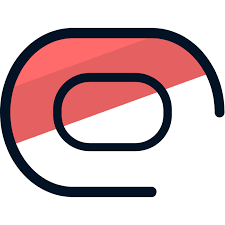
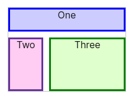
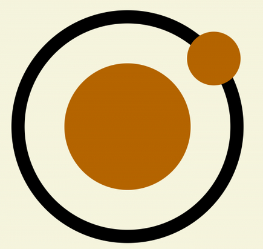
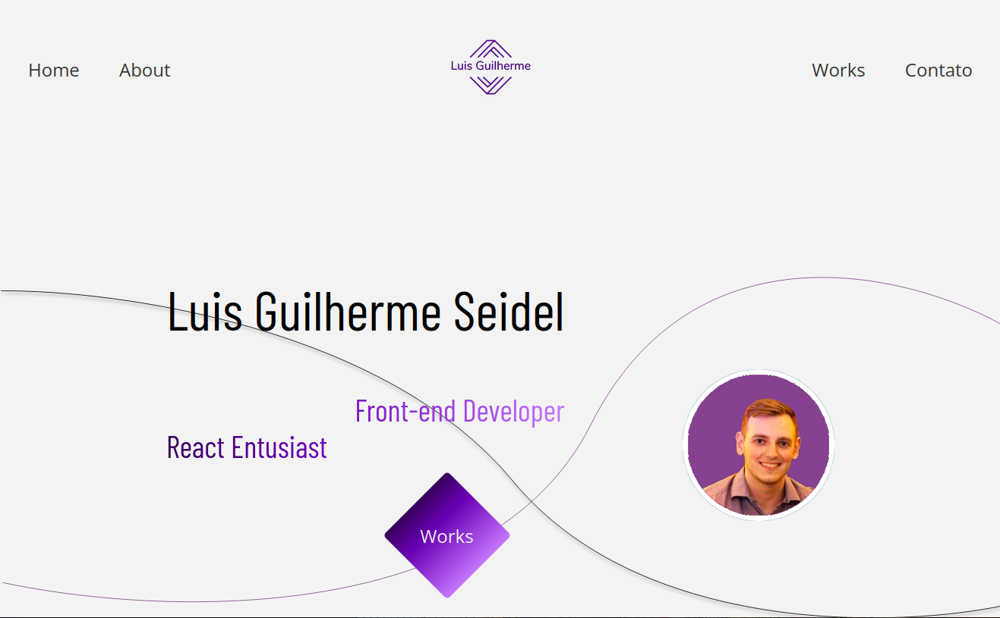
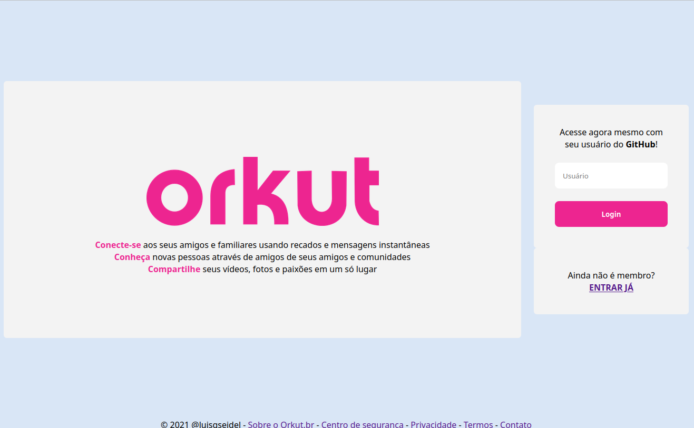
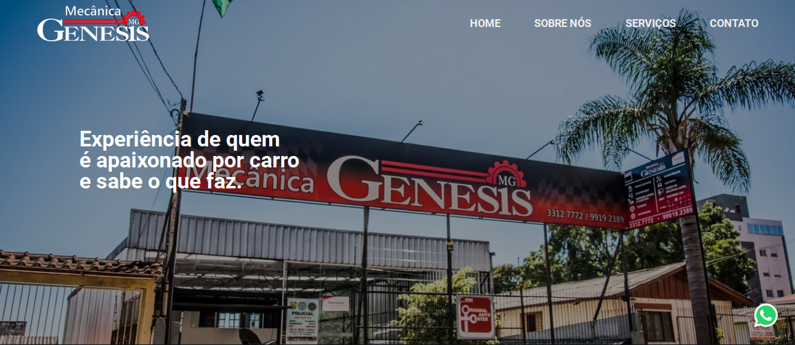
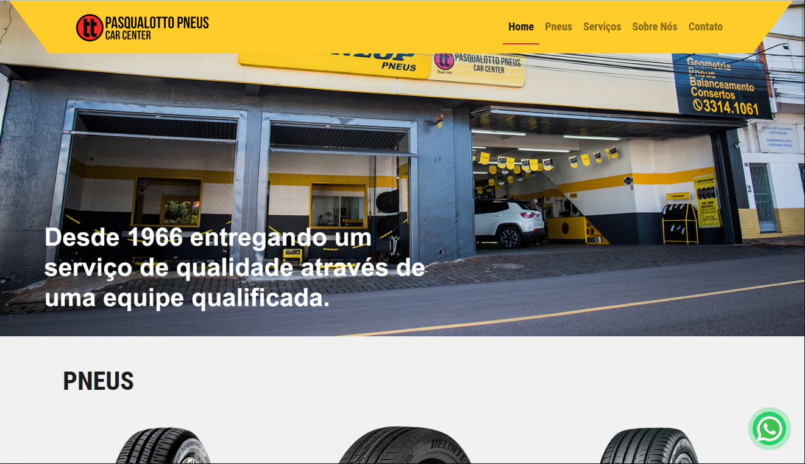
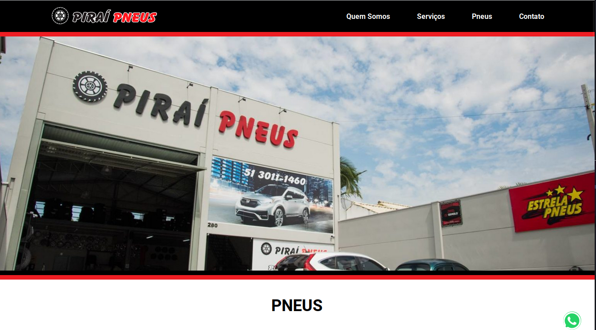

<h1>
  Olá, seja bem vindo! 
  Eu sou o Luis Guilherme Seidel
</h1>

  <h2>Sobre mim!</h2>
  <h4>(Clique em cada uma das setinhas para abrir!)</h4>

  

    Sou um desenvolvedor de software desde 2018 e, que já passou pelas seguintes tecnologias:     
  

    

      

         Linguagens
      

      <tr>
        <td></td>
        <td></td>
        <td></td>
      </tr>
    

    

      

         Frameworks
      

      <tr>
        <td> </td>
        <td> </td>
        <td> </td>
        <td> </td>
        <td> </td>
        <td> </td>
        <td> </td>
      </tr>
    

     

      

         Databases
      

      <tr>
        <td> </td>
        <td> </td>
        <td> </td>
        <td> </td>
        <td> </td>
        <td> </td>
      </tr>
    

    

      

        Front-End
      

      <tr>
        <td></td>
        <td></td>
        <td></td>
        <td></td>
        <td></td>
        <td></td>
      </tr>
    

  

    Em cada experiência, pude ver e desenvolver em uma tecnologia diferente, adquirindo mais habilidades e conhecendo diferentes formas de fazer coisas inscríveis. Abaixo, ficam algumas dessas.
  

    
Meu Site Portfólio

     
    

        
    

    
Aplicações em React

     
    

        
    

     
    

        
    

    
Sites em Wordpress/PHP

     
    

        
    

     
    

        
    

     
    

        
    

<h2>Estatísticas</h2>

